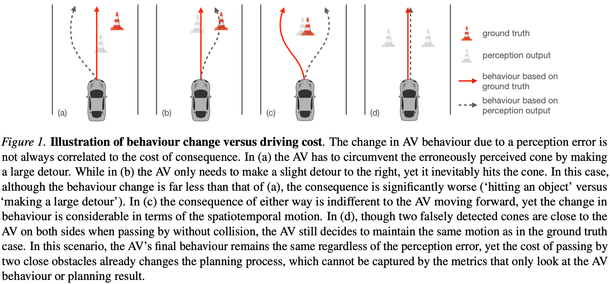
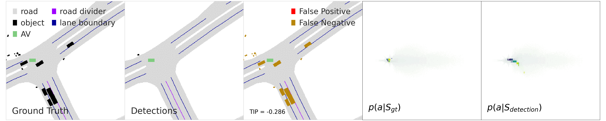
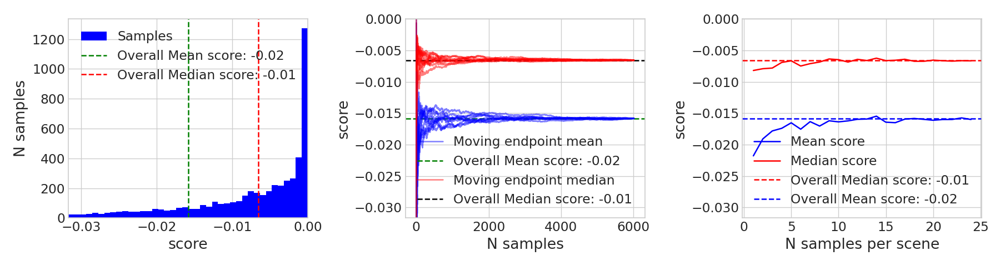
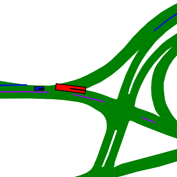
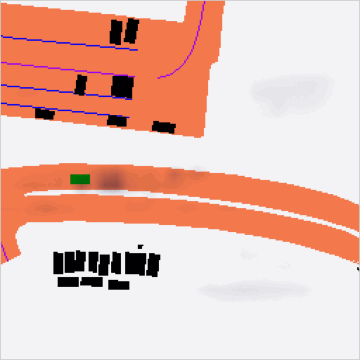

# Transcendental Idealism of Planner: Evaluating Perception from Planning Perspective for Autonomous Driving

International Conference on Machine Learning ([ICML 2023](https://icml.cc/Conferences/2023))<br>
[Wei-Xin Li](http://www.svcl.ucsd.edu/~nicolas/), [Xiaodong Yang](https://xiaodongyang.org/) <br>
[[Paper](https://arxiv.org/pdf/2306.07276.pdf)][[Poster](poster.pdf)]

<p align="left"> 
  
</p>

## Note
- This repository contains an example implementeation for a neural planner to exemplify our work.
- The dynamic range of the TIP score depends on that of the utility function. In this example implementation, the probability density map on a discrete grid is used in lieu of the utility function for the neural planner, thus the TIP score ranges between [-2, 0]. More context is available in the paper.
- This example implementeation is built on the [nuscenes-devkit library](https://github.com/nutonomy/nuscenes-devkit/blob/master/LICENSE.txt), and is adapted from the implementation of [Planner-KL Divergence (PKL)](https://github.com/nv-tlabs/planning-centric-metrics/blob/master/LICENSE), both of which use the Apache 2.0 License.

## Preparation
Download nuscenes data and maps from [https://www.nuscenes.org/](https://www.nuscenes.org/). We assume that [nuScenes](https://www.nuscenes.org/download) is located at `NUSCENES_ROOT` and nuScenes maps are located at `NUSCENES_MAP_ROOT`.

Install dependencies.

```
pip install nuscenes-devkit tensorboardY planning-centric-metrics
```

If neccesary, follow the [full tutorial](https://github.com/nv-tlabs/planning-centric-metrics#full-tutorial) of PKL to visulise the data, and train the neural planner (including the masks file).

Install this `ti-planner` package.
```
pip install -e .
```

## Score a submission with TIP
Score a nuScenes detection submission on an eval set. Set `--gpuid=-1` to use the CPU.
```
python main.py eval_test VERSION EVAL_SET --result_path=SUBMISSION --dataroot=NUSCENES_ROOT --map_folder=NUSCENES_MAP_ROOT --model_path=MODEL_PATH --mask_json=MASK_PATH --output_dir=OUTPUT_DIR
```
For instance, one can score a synthetic submission where all detections are removed from the ground truth by running
```
python main.py eval_test mini mini_train --result_path='./example_submission.json' --nworkers=8 --dataroot=NUSCENES_ROOT --map_folder=NUSCENES_MAP_ROOT --plot_kextremes=5 --output_dir='./result' --model_path='./planner.pt' --mask_json='./masks_trainval.json'
```
with output results
```
./result/planner_metric_tip.json
./result/TIP_worst0000.png
./result/TIP_worst0001.png
./result/TIP_worst0002.png
./result/TIP_worst0003.png
./result/TIP_worst0004.png
```
and statistics printout
```
{'min': -0.16451147198677063, 'max': -0.00033551082015037537, 'mean': -0.051448892802000046, 'median': -0.02976861782371998, 'std': 0.052457597106695175, 'top_worst': {311: -0.16451147198677063, 316: -0.16401930153369904, 317: -0.16395069658756256, 319: -0.16393756866455078, 322: -0.16389690339565277}}
```
5 scenes with the lowest TIP scores under the trained planner are (the lower the TIP score is, the worse the error is)


## TIP score distribution
Given the TIP scores produced from [CBGS](https://github.com/poodarchu/Det3D/tree/master/examples/cbgs) by the scoring functionality above, one can visualise the distribution of TIP scores by
```
python main.py eval_test trainval val --result_path=SCORE_JSON_PATH --nworkers=8 --dataroot=NUSCENES_ROOT --map_folder=NUSCENES_MAP_ROOT
```
```
python main.py score_distribution_plot trainval --score_result_path=SCORE_JSON_PATH --dataroot=NUSCENES_ROOT
```


## Sensitivity to false negatives and false positives by TIP
To understand the impact of false negatives, one can visualise the
significance of each ground-truth object by removing it from the correponding scene and computing the TIP.
```
python main.py false_neg_viz trainval --model_path=MODELPATH --dataroot=NUSCENES_ROOT --map_folder=NUSCENES_MAP_ROOT
```
<p align="center"> 

</p>

Similarly, one can visualise the importance of correctly not predicting a false positive at each location in a grid around the ego.
```
python main.py false_pos_viz trainval --model_path=MODELPATH --dataroot=NUSCENES_ROOT --map_folder=NUSCENES_MAP_ROOT
```


## Citation
If you found this codebase useful in your research or work, please consider citing
```
@InProceedings{Li_2023_ICML,
author = {Li, Wei-Xin and Yang, Xiaodong},
title = {Transcendental Idealism of Planner: Evaluating Perception from Planning Perspective for Autonomous Driving},
booktitle = {International Conference on Machine Learning (ICML)},
year = {2023}
}
```

## License
Copyright (C) 2023 QCraft. All rights reserved. Licensed under the [CC BY-NC-SA 4.0](https://creativecommons.org/licenses/by-nc-sa/4.0/legalcode) (Attribution-NonCommercial-ShareAlike 4.0 International). The code is released for academic research use only. For commercial use, please contact [business@qcraft.ai](business@qcraft.ai).
